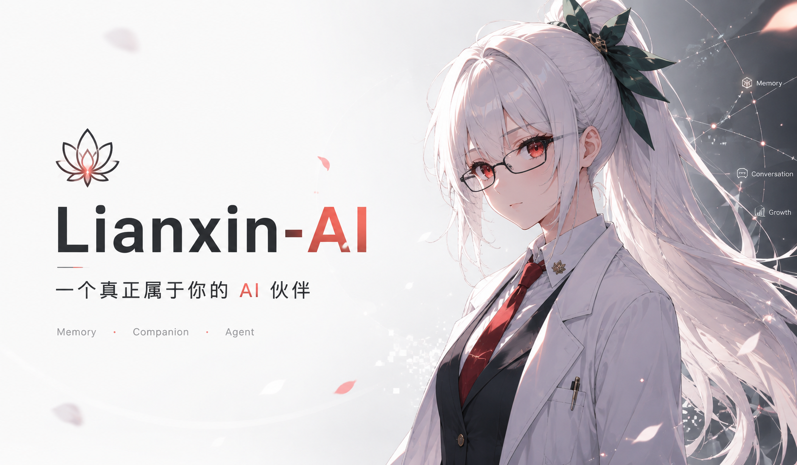
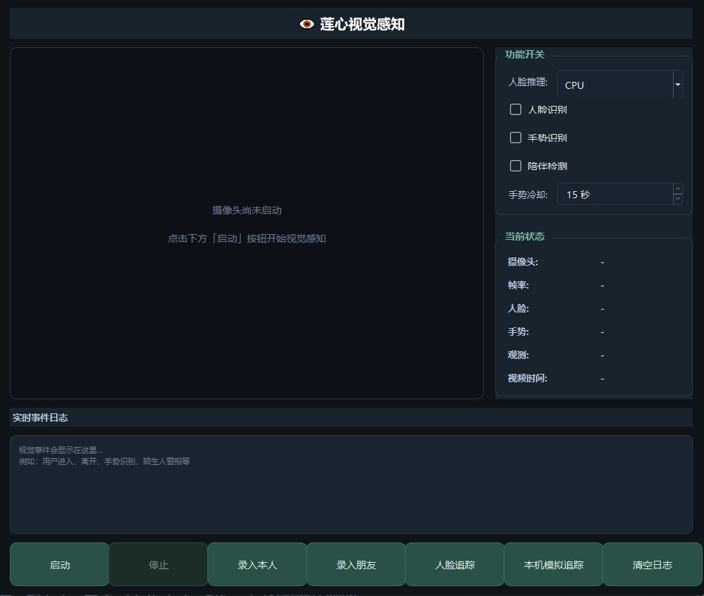
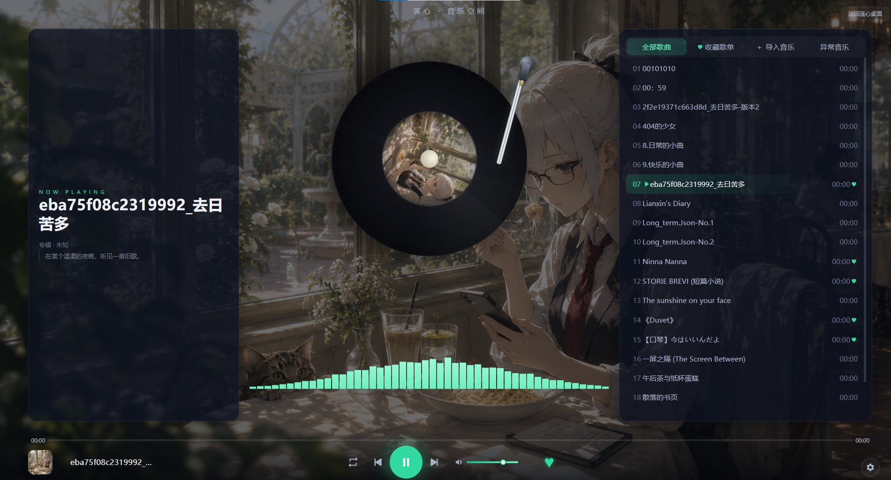
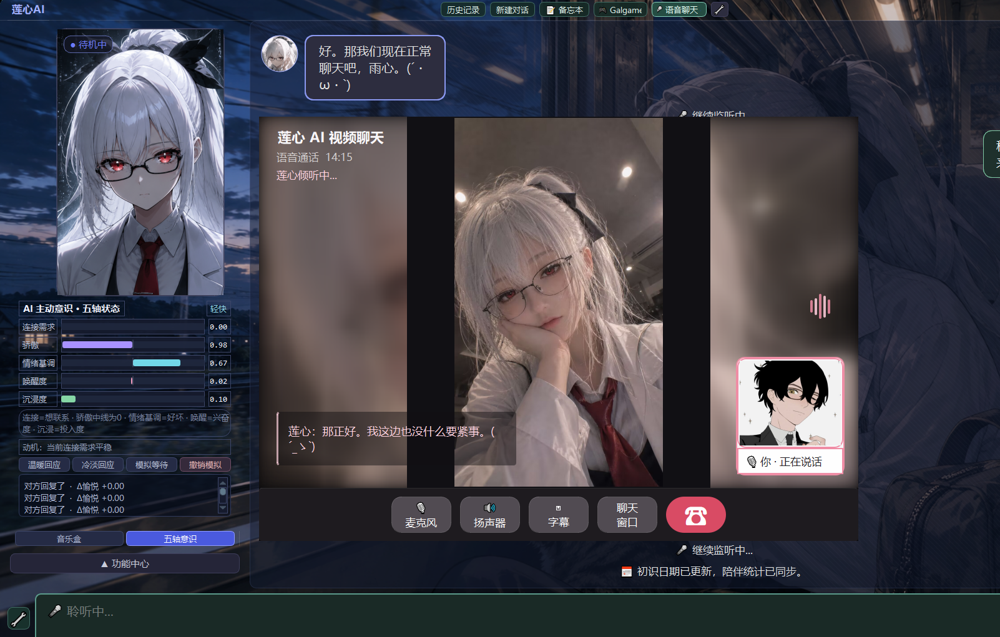
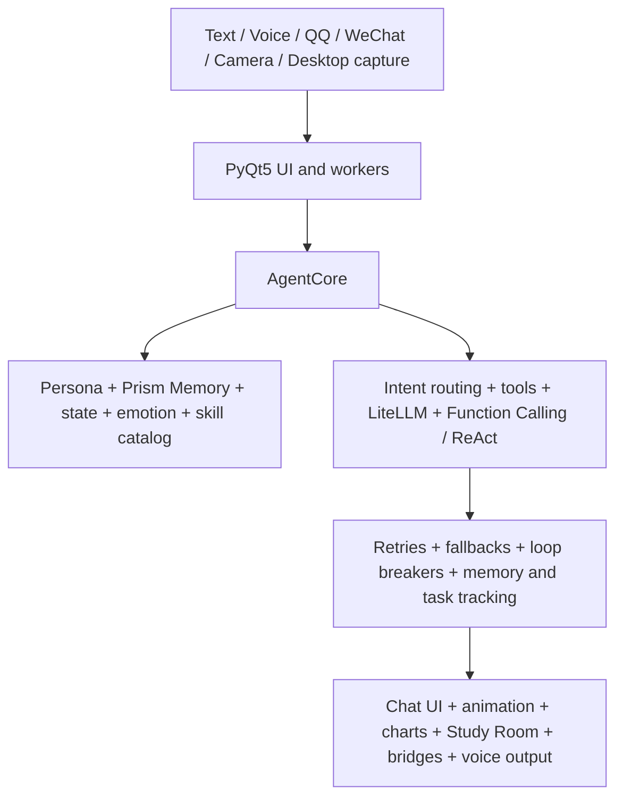

# Lianxin AI

> **Language / 语言:** English | [简体中文](README_CN.md)



<p align="center">
  
  
  
  
  
  
</p>

> A Windows desktop AI companion with persistent memory, emotional state, editable personas, and proactive behaviors.

Lianxin AI is a Python desktop companion for Windows 10 and 11. It combines a PyQt5 interface with cloud or local LLMs through LiteLLM. Rather than treating every prompt as an isolated exchange, it keeps local, inspectable state across conversations: factual memory, a knowledge graph, working memory, persona snapshots, emotional dynamics, and scheduled responsibilities.

The project is inspired by the Endless Library setting from *Anomaly Handler*. It is designed as an AI character that can converse, remember, help with daily work, interact with local tools under permission boundaries, and reach users through optional QQ and WeChat bridges.

## Choose Your Language

| Documentation | Best for |
|---|---|
| **[English README](README.md)** | International users, contributors, and English-language setup instructions |
| **[Chinese README / README_CN.md](README_CN.md)** | Chinese product documentation, detailed feature descriptions, and Chinese-language guidance |

## Contents

- [Highlights](#highlights)
- [Architecture](#architecture)
- [Core Systems](#core-systems)
- [Persona Control Hub](#persona-control-hub)
- [Proactive consciousness](#proactive-consciousness)
- [Study Room](#study-room)
- [Time Capsule and Data Tide](#time-capsule-and-data-tide)
- [Tools, vision, and voice](#tools-vision-and-voice)
- [Skills and MCP](#skills-and-mcp)
- [Optional Integrations](#optional-integrations)
- [Quick Start](#quick-start)
- [Configuration](#configuration)
- [Project Layout](#project-layout)
- [Data and Privacy](#data-and-privacy)
- [Development](#development)
- [License and Assets](#license-and-assets)

## Highlights

| Area | What Lianxin AI provides |
|---|---|
| Conversational AI | Multi-turn chat, context compression, tool calling, retry handling, and stale-response protection |
| Model providers | DeepSeek, Agnes AI, OpenAI-compatible endpoints, and local Ollama models |
| Prism Memory | Categorized facts, a five-tuple knowledge graph, semantic retrieval, current state, and working memory |
| Emotional continuity | A five-axis state model with event appraisal, history, relationship signals, and visible diagnostics |
| Personas | Create, validate, preview, hot-activate, and switch persona profiles for new conversations |
| Proactive presence | Time-aware proactive chat, desktop observation, Bilibili browsing, idle activities, cooldowns, and pause controls |
| Study Room | A focus workspace with tasks, Pomodoro sessions, growth records, a yearly heatmap, wallpapers, and notes |
| Time Capsule | Shared journals, a timeline, anonymous messages, a collection space, migration of legacy diaries, and memory links |
| Tools and media | Weather, files, browser automation, music, screenshots, camera input, OCR, image generation, and speech |
| VisionLab | Face recognition and enrollment, OK/thumbs-up/wave gesture recognition, presence and posture detection, with CPU/GPU switching |
| Voice stack | Local FunASR speech recognition, full-duplex interruption, GPT-SoVITS multi-version voice synthesis, and Edge-TTS fallback |
| Bridges | Optional QQ WebSocket and WeChat AstrBot integrations |
| Automation | Natural-language scheduled tasks, execution records, failure handling, and ReAct tool execution |
| Extensions | Dynamically discovered Skills packages and MCP services |


## Feature Demonstrations

[Watch the Lianxin feature demonstration on Bilibili](https://www.bilibili.com/video/BV1BM3R61Ew4/?spm_id_from=333.1387.favlist.content.click)

The demonstration covers Lianxin's desktop interaction, visual perception, voice interaction, and companion behaviors. The full documentation remains in this README; the screenshots are introduced alongside the features they represent.

### VisionLab



Lianxin can interact with you through an independent local vision module. It recognizes OK, thumbs-up, and waving gestures, identifies whether the person in the frame is the enrolled user, and measures how long you have been sitting at the desk. When appropriate, the companion can remind you to rest and move around. Face enrollment, gesture recognition, presence, posture detection, and CPU/GPU selection are available without sending every video frame to the LLM.

### Music Space



Music Space is a local interface for importing and managing personal music, playback control, synchronized playback state, and an ambient visual presentation. It can be used independently during companionship, study, or rest.

### Video and voice calls



The video-call interface combines camera presentation, voice input, and Lianxin's speech output in one interaction window. It uses an independent presentation path and can be enabled after configuring a local or cloud speech-recognition and synthesis backend.

## Architecture



The architecture is shown as a Mermaid flowchart so its relationships remain readable across GitHub, Gitee, and mobile browsers.

### Request lifecycle

1. A message enters from the desktop UI, voice input, or an enabled bridge.
2. `AgentCore` combines the active persona, relevant memory, current state, emotional context, and only the tools needed for the request.
3. LiteLLM sends the request to the selected provider.
4. Tool calls are permission-checked, executed, recorded, and returned to the model when needed.
5. The response updates the UI and may update emotional state, memory, or task tracking.

## Core Systems

### Prism Memory

Prism Memory is a local, layered memory architecture rather than a single chat-history list.

- **Categorized factual memory** stores user facts and project knowledge with source and time metadata.
- **Five-tuple knowledge graph** tracks entities, relations, provenance, confidence, and temporal scope.
- **Semantic retrieval** can use local vector embeddings when the RAG dependency profile is installed.
- **Current state** holds short-lived, time-sensitive facts.
- **Working memory** preserves active topics and summaries during ongoing conversations.
- **Maintenance workers** consolidate candidates and retain traceable source information instead of silently replacing raw data.

### Ripple Emotion System v3

The Ripple system models emotional continuity through slowly changing state variables instead of selecting a random mood for each reply. Event appraisal, relationship context, persona limits, motivation, and state history can influence tone, proactive behavior, and visible diagnostics without overriding tool safety or factual correctness.

### Persona Control Hub

Persona profiles define identity, relationship framing, style, boundaries, and runtime prompts. Profiles can be edited, validated, previewed, activated without restarting the application, and applied to new conversations while preserving historical facts.

### Proactive Presence

Lianxin can initiate contact under explicit schedule, cooldown, and pause controls. Optional activities include proactive chat, desktop observation, Bilibili history-based browsing, idle behavior, and reminders. User input takes priority and can interrupt background behavior.

### Study Room and Time Capsule

The Study Room provides a focused independent workspace built with PyQtWebEngine and QWebChannel. Time Capsule adds shared records, a timeline, private messages, collections, and links to local long-term memory. Both keep their data locally.

### Memory flow and safeguards

```text
User message
    -> candidate facts and current-state updates
    -> provenance, category, confidence, and time-scope checks
    -> local fact store / knowledge graph / working-memory summary
    -> retrieval only when it is relevant to a later request
```

Memory is not treated as an instruction authority. Persona identity, privacy, permissions, and runtime safety rules remain authoritative even when historical conversation data conflicts with them. Entries can be traced back to their source messages and reviewed instead of being silently rewritten.

### The five emotional axes


The Ripple model records five slowly varying dimensions: positive affect, arousal, security, connection need, and pride. Appraisal evaluates the event and its context; dynamics smooth the change over time; tone generation stays within the active persona's boundaries. Emotional state can inform expression and proactive behavior, but it cannot claim unverified facts, bypass a permission check, or alter the persona's identity.


### Star Maps

The application contains two interactive, read-only visualizations.

- **Memory Star Map** shows memory objects, relations, source messages, timelines, and detail panels.
- **Ripple Star Map** shows current emotional state, important events, relationship signals, and historical snapshots.

Both are rendered with PyQt WebEngine and QWebChannel. A node can request a snapshot or open its source record, but browser-side views cannot directly modify memory.


### Persona Control Hub

Persona Control Hub separates *identity* from *state*. A profile describes Lianxin's name, user form of address, style, relationship framing, and non-negotiable behavioral boundaries. Memory and emotion are maintained independently at runtime.

Profiles support creation, editing, validation, preview, and hot activation. Switching a profile changes the active persona snapshot for future turns; it does not erase factual history or grant new tool permissions. Conflicting legacy character descriptions are ignored unless the user explicitly requests an audit.

### Proactive consciousness

Proactive features are scheduled independently from ordinary chat and are designed to remain interruptible.

| Activity | Behavior |
|---|---|
| Proactive chat | Starts a context-aware conversation within configured time windows, probability, cooldown, and deduplication rules |
| Playful observation | Can use explicitly enabled desktop or camera observations as structured signals, not as unrestricted surveillance |
| Bilibili browsing | Uses configured history and browser capabilities to propose relevant content |
| Idle activity | Performs lightweight, scheduled activities when the user has been inactive |
| Duty center | Coordinates heartbeats, reminders, tasks, memory maintenance, and narrative consolidation |

User messages take precedence. Pause controls, cooldowns, rate limits, and cancellation paths prevent background behavior from competing with an active conversation.

### Study Room


Lianxin Study Room is a separate focus space with a task list, Pomodoro-style timer, immersive focus mode, growth records, annual heatmaps, wallpapers, and messages. Its Python services communicate with the embedded HTML/CSS/JavaScript frontend through QWebChannel.

- Focus sessions are maintained by an explicit state machine rather than a UI-only counter.
- Tasks, focus records, and growth information are stored in a dedicated local SQLite database.
- The room provides time review and personal-space views without mixing these records into the main conversation database.
- PyQtWebEngine is part of the core dependency profile; a PyQt5-only installation cannot load this interface.

### Time Capsule and Data Tide


Time Capsule offers paired journal pages, a time corridor, a private tree-hole space, collections, legacy-diary migration, and explicit links to long-term memory. It is designed for local, reviewable records rather than an opaque archive.


Data Tide presents local interaction and growth history in a coastal overview and achievement list. These views are product-facing representations of local records; they do not change the privacy boundary or upload personal data.


### Tools, vision, and voice

The tool layer includes weather, system information, files, browser actions, music control, notes, reminders, tasks, and Time Capsule operations. Calls pass through capability discovery, request policy, permission boundaries, execution logging, result handling, retries, and loop breakers.

Visual capabilities include screenshots, camera input, OCR, image description, image generation, and the independent VisionLab window. VisionLab supports face recognition and personal-feature matching, OK/thumbs-up/wave gestures, presence and posture detection, hot-swappable features, and CPU/GPU inference selection. Local event recognition can feed character animation, emotion, or proactive behavior without sending every video frame to a model.

Voice capabilities include local FunASR speech-to-text with CPU/GPU selection, full-duplex listening and interruption, reference-audio transcription, GPT-SoVITS v2/v3/v4 voice synthesis, emotion parameters, lazy model loading, and Edge-TTS fallback. Install the matching dependency profile and configure required external services. QQ voice delivery may require FFmpeg to convert generated audio to SILK.

### Companion modes and hardware


Optional modes include a Galgame presentation, desktop companion window states, standby voice companionship, shoulder-mounted camera control, ESP32-CAM video streaming, and face tracking with a local face box, error vector, and pan/tilt closed loop. The former MediaPipe human-tracking entry is deprecated. Hardware and browser capabilities remain opt-in and are constrained by the same permission and safety layers as other tools.

The shoulder device can be observed and controlled through the Cloud Relay: photo capture, device status, temperature and humidity, pan/tilt commands, and the ESP32-CAM stream are exposed as separate capabilities. Face tracking can run independently from the LLM after the stream is connected.

### Skills and MCP

Skills are pluggable capability packages. A skill normally contains a `SKILL.md` describing its knowledge and use boundaries together with tool definitions. The runtime discovers, registers, enables, disables, and progressively injects relevant skills so unrelated tool descriptions do not consume every request context.

MCP services can expose additional tools through the same controlled workflow. Service availability, tool authorization, errors, and results remain visible to the request loop rather than becoming hidden model-side actions.

The repository also includes a read-only GitHub MCP skill for repository search, file reading, and commit inspection. QQ bridging supports recent contacts, owner-specific queries, voice delivery, message segmentation, session isolation, and interruption of stale replies. Avatar interaction and companion statistics are recorded locally with a privacy boundary that keeps them out of long-term memory unless explicitly promoted.

### Resource guidance and lightweight use

The base desktop profile is intended to run without a dedicated GPU when using a cloud text model. Install RAG, vision, voice, browser, and bridge packages only when needed. Local embedding models and local LLMs can increase memory, disk, CPU, and first-use download costs considerably.

For a stable lightweight setup:

1. Install `requirements-core.txt` first.
2. Use a configured cloud provider for the main conversation model.
3. Keep local vector retrieval, camera processing, and voice engines disabled until required.
4. Enable one optional profile at a time and verify startup, chat, and logs before enabling another.

### Headless Docker simulation

The repository also provides a Docker-oriented, no-GUI simulator path for experimentation. It is not a replacement for the Windows desktop application. Simulator state is intentionally ephemeral unless a separate persistent volume and authentication design are introduced.

```powershell
docker compose up --build
docker compose down
```

## Optional Integrations

| Integration | Purpose | Notes |
|---|---|---|
| Ollama | Local text models | Configure the provider as `local` and run Ollama separately |
| SiliconFlow | Visual understanding | Used for screenshot analysis and camera observation when configured |
| GPT-SoVITS / Edge-TTS | Speech output | Optional voice stack; some QQ voice flows require FFmpeg |
| QQ bridge | QQ message access | Configure a WebSocket endpoint and owner account details |
| WeChat bridge | WeChat message access | Uses AstrBot integration |
| Playwright | Browser automation | Install Chromium after installing the browser dependency profile |
| MCP | Tool servers | Services are discovered and enabled through the extension system |

## Quick Start

### Requirements

- Windows 10 or 11
- Python 3.11 or 3.12
- At least one supported text-model provider

The recommended first-run path creates a project-local virtual environment, installs the base desktop dependencies, and initializes user configuration under your home directory:

```powershell
.\bootstrap.bat
.\run.bat
```

Or create an environment manually:

```powershell
conda create -n lianxin python=3.12
conda activate lianxin
pip install -r requirements-core.txt
python main.py
```

### Dependency Profiles

| Command | Includes |
|---|---|
| `pip install -r requirements-core.txt` | Default desktop app, cloud chat, SQLite memory, Time Capsule, Study Room, and physical simulator |
| `pip install -r requirements-rag.txt` | Local semantic memory retrieval; installs PyTorch and downloads an embedding model on first use |
| `pip install -r requirements-voice.txt` | Local speech input and audio processing |
| `pip install -r requirements-vision.txt` | Camera, OCR, and visual processing |
| `pip install -r requirements-browser.txt` | Playwright browser automation and web extraction |
| `pip install -r requirements-bridge.txt` | QQ / WeChat bridges and MCP integration |
| `pip install -r requirements.txt` | Full compatibility dependency set for maintainers or users who want all optional capabilities |

After installing the browser profile, install a browser binary:

```powershell
playwright install chromium
```

## Configuration

Configure a model from the settings UI after launch, or edit:

```text
%USERPROFILE%\.lianxin\user_config.json
```

Example for DeepSeek:

```json
{
  "deepseek": {
    "api_key": "YOUR_API_KEY",
    "base_url": "https://api.deepseek.com",
    "model": "deepseek-v4-flash",
    "provider": "deepseek"
  }
}
```

The application also supports Agnes AI and OpenAI-compatible endpoints through the configuration UI, plus Ollama via the `local` provider. Keep API keys, cookies, local databases, and logs out of version control.

### Bridges and response delivery

QQ and WeChat bridges are optional. The QQ settings panel can manage the bridge connection, response pacing, voice replies, and whether long Lianxin replies are delivered as semantic segments or as one complete message. The segmentation option affects only outgoing Lianxin text; it does not alter model content or user-message merging.

## Project Layout

```text
Lianxin-AI/
├── main.py                 # Application entry point and startup checks
├── config.py               # Configuration and provider settings
├── brain/                  # Agent, tools, memory, emotion, personas, MCP
├── gui/                    # PyQt5 UI, charts, persona hub, Study Room
├── workers/                # Background model, bridge, voice, and maintenance workers
├── utils/                  # Schedulers and shared utilities
├── skills/                 # Pluggable skill packages
├── assets/                 # Visual and audio resources
├── memory/                 # Local SQLite data directory
├── logs/                   # Runtime logs
├── README.md               # English documentation (this file)
└── README_CN.md            # Complete Chinese documentation
```

For the detailed Chinese product description, system diagrams, workflows, and feature-by-feature documentation, see [README_CN.md](README_CN.md).

## Data and Privacy

| Data | Default location | Format |
|---|---|---|
| User configuration | `%USERPROFILE%\.lianxin\user_config.json` | JSON |
| Conversations and memory | `memory/` | SQLite and JSON |
| Emotional state | `memory/` | SQLite |
| Study Room records | `%USERPROFILE%\.lianxin\study_room.db` | SQLite |
| Logs | `logs/` | Text files |

- Memory, emotional state, and configuration are stored locally by default.
- The application does not proactively upload local data.
- Tool execution follows permission boundaries and is not intended to execute dangerous actions unconditionally.
- Memory writes retain source messages and time scope for review and auditing.

Read [PRIVACY.md](PRIVACY.md) for the complete privacy boundary.

## Development

Before opening a pull request or publishing a fork:

- Do not commit API keys, cookies, user configuration, local databases, or logs.
- Preserve existing permission checks and failure recovery when adding tools.
- Keep background work from blocking ordinary chat.
- Preserve memory provenance and time scope.
- Test tool failure paths as well as success paths.

See [README_CN.md](README_CN.md) for the Chinese development checklist and full feature documentation.

## License and Assets

The source code is licensed under the [MIT License](LICENSE), subject to its copyright and notice requirements. The MIT license applies only to source code for which project maintainers hold the relevant rights. Third-party dependencies, music, sound effects, character assets, model weights, and other binary resources are not automatically licensed under MIT.

Read [ASSET_NOTICE.md](ASSET_NOTICE.md) for asset availability and additional conditions.

## Acknowledgements

- [LiteLLM](https://github.com/BerriAI/litellm) for unified LLM access
- [PyQt5](https://www.riverbankcomputing.com/software/pyqt/) for the desktop UI
- [AstrBot](https://github.com/AstrBotProject/AstrBot) for messaging-bridge support
- [SiliconFlow](https://siliconflow.cn/) for cloud visual APIs
- [GPT-SoVITS](https://github.com/RVC-Boss/GPT-SoVITS), [FunASR](https://github.com/modelscope/FunASR), and [Whisper](https://github.com/openai/whisper) for voice-related capabilities

## Disclaimer

This project is intended for learning, research, and personal use. Users are responsible for compliance with local law, third-party API terms, and platform rules. The project does not guarantee model output, external services, browser actions, or protection against user-data loss.


