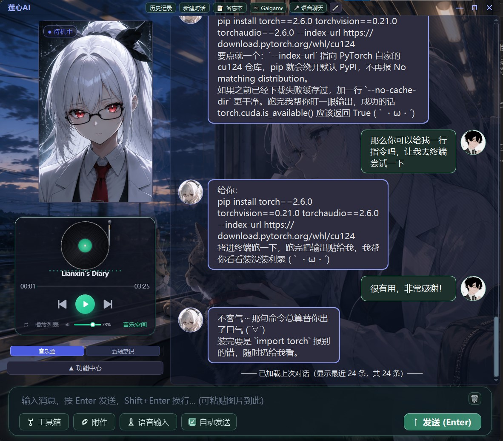
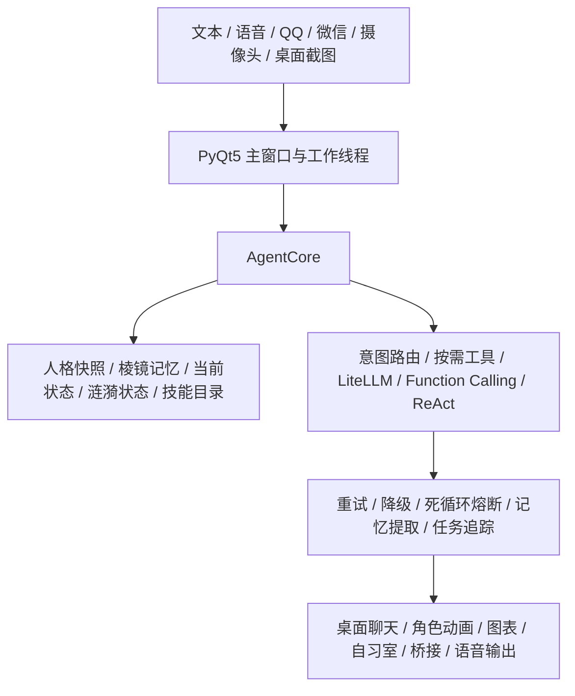
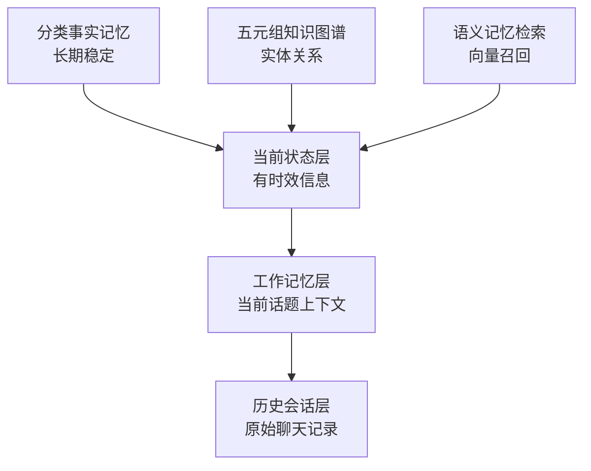
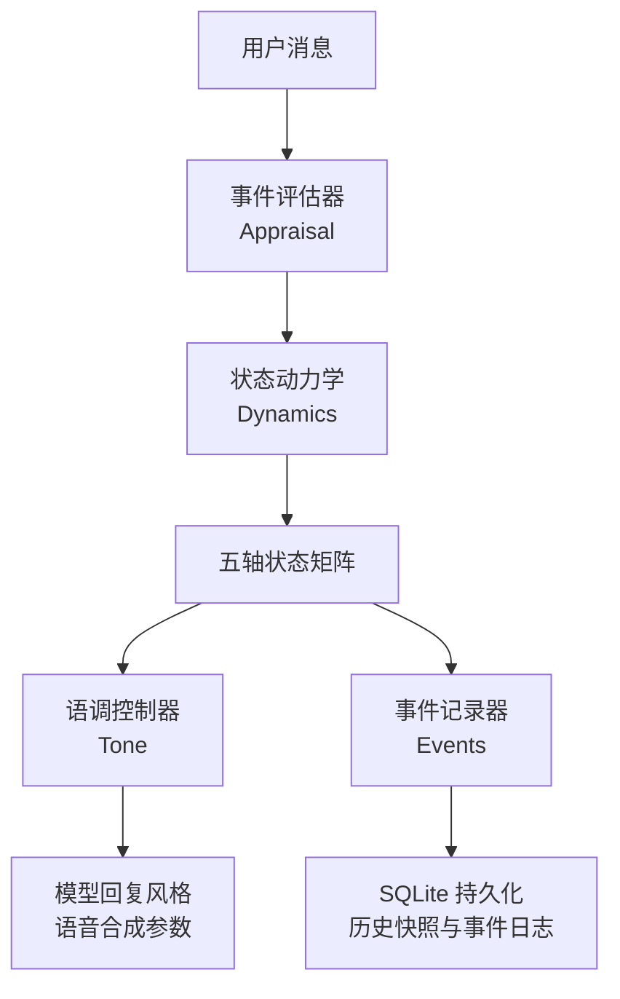

# 莲心 AI

> **语言 / Language:** 简体中文 | [English](README.md)

> **继续阅读：** 本页介绍项目定位、核心能力、记忆、情感与星图系统；[进阶功能、部署、配置与参考](README_CN_ADVANCED.md) 请见第二部分。

<p align="center">
  
  
  
  
  
  
  
</p>

> **一个拥有记忆、情感、人格与主动意识的 Windows 桌面 AI 伙伴。**

莲心来自《异象处理者》的无尽书馆设定。她像是从一座永远不会熄灯的书馆里走出来的管理员，带着白色书页、安静的灯光和一点不肯被遗忘的执拗，住进你的 Windows 桌面。

她会记住你反复提到的项目，会在你需要时处理文件、天气和系统信息，也会在长久沉默之后轻轻问一句"最近还好吗"。她不是把回答发送完就归零的程序，而是在每次对话、每次记忆和每次状态变化中，逐渐形成连续感的 AI 角色。


---

## 目录

- [项目定位](#项目定位)
- [核心能力一览](#核心能力一览)
- [系统架构](#系统架构)
- [棱镜记忆系统](#棱镜记忆系统)
- [涟漪情感系统](#涟漪情感系统)
- [星图系统](#星图系统)
- [进阶功能、部署与参考](README_CN_ADVANCED.md)
- [人格枢控系统](#人格枢控系统)
- [AI 主动意识](#ai-主动意识)
- [莲心自习室](#莲心自习室)
- [时间胶囊](#时间胶囊)
- [数据潮汐与成就记录](#数据潮汐与成就记录)
- [工具、视觉与语音](#工具视觉与语音)
- [扩展生态](#扩展生态)
- [运行资源与轻薄本模式](#运行资源与轻薄本模式)
- [快速开始](#快速开始)
- [项目结构](#项目结构)
- [数据与隐私](#数据与隐私)
- [许可证](#许可证)
- [开发与测试](#开发与测试)
- [参考与致谢](#参考与致谢)
- [免责声明](#免责声明)

---

## 项目定位

莲心 AI 是一个面向 **Windows 10/11** 的 Python 桌面 AI 伴侣项目，使用 **PyQt5** 构建界面，通过 **LiteLLM** 连接云端或本地大模型。

项目关注的不是单次问答，而是以下长期能力：

| 能力 | 说明 |
|------|------|
| 记忆可追溯 | 分类事实、知识图谱、向量检索、当前状态、工作记忆五层协同 |
| 情感连续态 | 五轴动力变量缓慢变化，而非每轮随机生成情绪标签 |
| 人格可编辑 | 人格档案可创建、预览、校验、热激活和切换 |
| 主动行为 | 独立调度、冷却、暂停机制的主动聊天与观察 |
| 工具安全 | 权限边界、错误恢复、日志记录和死循环熔断 |
| 状态可见 | 记忆星图、涟漪控制台让人格内部状态可被理解 |



---

## 功能演示视频

[观看莲心功能演示视频（Bilibili）](https://www.bilibili.com/video/BV1BM3R61Ew4/?spm_id_from=333.1387.favlist.content.click)

视频中展示了莲心的桌面交互、视觉感知、语音和陪伴能力。完整 README 保留在同一文件中，不为了图片展示而拆分功能说明。

## 核心能力一览

| 功能域 | 核心能力 | 状态 |
|--------|----------|------|
| 智能对话 | 多轮聊天、上下文压缩、工具调用、失败重试、回复保护 | 核心可用 |
| 多模型支持 | DeepSeek、Agnes、OpenAI 兼容接口、Ollama 本地模型 | 可选配置 |
| 棱镜记忆 | 分类事实、五元组知识图谱、向量检索、当前状态、工作记忆 | 核心可用 |
| 记忆星图 | 记忆对象、关系、来源消息、时间线和详情可视化 | 核心可用 |
| 涟漪情感 | 五轴状态、事件原因、关系状态、动机和历史快照 | 核心可用 |
| 人格枢控 | 人格档案编辑、预览、校验、热激活、新会话切换 | 核心可用 |
| 主动聊天 | 按时段/概率主动发起，支持暂停、冷却和去重 | 核心可用 |
| 主动行为 | 桌面观察、B 站冲浪、摸鱼、随机提问统一调度 | 可选配置 |
| 莲心自习室 | 独立专注空间、任务清单、番茄计时、成长统计、年度热力图、壁纸与留言 | 核心可用 |
| 时间胶囊 | 双页共同记录、时间长廊、树洞、收藏馆、旧日记无损迁移与长期记忆关联 | 核心可用 |
| 后台职责 | 心跳、自检、提醒、待办、记忆维护、叙事整理 | 核心可用 |
| 视觉理解 | 截图、摄像头、OCR、图片描述、图像生成 | 可选配置 |
| VisionLab 视觉实验室 | 人脸识别与本人特征匹配、OK/大拇指/挥手识别、陪伴与姿态检测、CPU/GPU 切换 | 可选配置 |
| 语音交互 | 语音输入、全双工监听、打断、Edge-TTS、GPT-SoVITS | 可选配置 |
| 本地语音识别 | FunASR、预热、全双工监听、打断、CPU/GPU 推理与云端回退 | 可选配置 |
| 工具箱 | 天气、系统信息、文件、浏览器、音乐、时间胶囊、备忘、任务 | 核心可用 |
| 外部桥接 | QQ WebSocket、微信 AstrBot、浏览器自动化 | 可选配置 |
| 扩展系统 | Skills 技能包和 MCP 服务动态发现、启用和停用 | 可选配置 |
| 任务自动化 | 自然语言解析任务并通过 ReAct 工具链执行 | 实验性 |
| 肩载设备 | ESP32-CAM 推流、拍照、状态、温湿度、云台控制与本人脸闭环追踪 | 可选配置 |


---

## 视觉、音乐与视频通话

### 莲心视觉感知


莲心可以通过独立的视觉感知模块与你进行更自然的互动。她可以识别 OK、大拇指、挥手等手势并做出反应，也可以识别画面中的人脸，判断屏幕中是否是已经录入特征的你。陪伴检测还能记录你坐在桌前陪伴她的时间，在适当时刻提醒你休息、活动和保护视力。

视觉模块支持人脸特征录入与匹配、手势识别、陪伴检测、姿态检测以及 CPU/GPU 推理切换。视觉事件在本地处理后可以驱动角色动画、情绪反馈或主动行为，不需要把每一帧摄像头画面都发送给大模型。

### 音乐空间


音乐空间是莲心独立的本地音乐界面，支持导入和管理个人音乐、播放控制、播放状态同步以及空间化的视觉呈现。它和聊天、时间胶囊等模块保持相对独立，可以在陪伴、学习或休息时作为背景空间使用。

### 视频语音通话


视频语音通话界面将摄像头画面、语音输入和莲心的语音输出放在同一个交互窗口中。它目前采用独立的通话展示链路，不依赖特定的 GPT-SoVITS 声线；在配置好本地或云端语音识别、语音合成后即可按需启用。

## 系统架构

为避免中文全角字符在不同等宽字体中造成错位，架构关系采用 Mermaid 表达；下方文字说明保留了各层职责。



---

## 棱镜记忆系统

棱镜记忆系统不是简单的记忆列表，而是**多种记忆层协同工作**的本地记忆架构。

### 记忆系统全景图



<!-- Legacy diagram removed: the Mermaid graph above avoids CJK width drift. -->
<!--
```text
┌─────────────────────────────────────────────────────────────┐
│                    记忆系统全景图                             │
│                                                             │
│  ┌──────────────┐  ┌──────────────┐  ┌──────────────┐      │
│  │ 分类事实记忆  │  │ 五元组知识图谱│  │ 语义记忆检索  │      │
│  │ (长期稳定)    │  │ (实体关系)    │  │ (向量召回)    │      │
│  └──────┬───────┘  └──────┬───────┘  └──────┬───────┘      │
│         │                 │                 │               │
│         ▼                 ▼                 ▼               │
│  ┌─────────────────────────────────────────────────────┐    │
│  │              当前状态层 (有时效信息)                  │    │
│  └─────────────────────────┬───────────────────────────┘    │
│                            │                                │
│                            ▼                                │
│  ┌───────────────────────────────────────────────────┐      │
│  │            工作记忆层 (当前话题上下文)              │      │
│  └───────────────────────────────────────────────────┘      │
│                                                             │
│  ┌───────────────────────────────────────────────────┐      │
│  │            历史会话层 (原始聊天记录)                │      │
│  └───────────────────────────────────────────────────┘      │
└─────────────────────────────────────────────────────────────┘
```
-->

### 六层记忆架构

| 层级 | 职责 | 生命周期 | 数据源 |
|------|------|----------|--------|
| **分类事实记忆** | 长期稳定事实：身份、职业、偏好、项目、技能 | 永久保存，用户可删除 | 自动提取 + 用户指令 |
| **五元组知识图谱** | 实体关系建模：人物、地点、组织、项目、事件 | 长期保存，随新信息增长 | 提取 + 用户确认 |
| **语义记忆检索** | 中文 embedding 向量索引，相似度 + 质量 + 时间召回 | 与事实记忆同步 | 向量数据库 |
| **当前状态** | 有时效信息：生病、短期计划、所在地 | 有过期时间，自动结束 | 对话 + 工具结果 |
| **工作记忆** | 当前话题、未闭环问题、临时任务摘要 | 短期保留，不升级为永久 | 对话上下文 |
| **历史会话** | 原始聊天记录，支持回顾和审计 | 永久保存 | 所有渠道消息 |

### 分类事实记忆

负责保存不应随上下文窗口消失的内容。事实分为**个人资料、偏好、事件、知识、行为和技能**等类别，并记录创建时间、更新时间、来源渠道、来源消息和证据片段。

- 支持用户明确纠正更新旧事实
- 发现矛盾内容时生成冲突候选，不直接覆盖
- 来源追溯可查看记忆来自哪次对话
- 用户可搜索、修改、删除和清理记忆

### 五元组知识图谱

将人物、地点、组织、项目、作品、兴趣和事件建模为可连接的实体，用**"主体—关系—客体"**保存结构化联系，并保留实体类型、关系来源和强度。

> 分类事实适合表达"用户是一名算法工程师"，图谱则适合表达"用户—参与—无人机基站巡检项目"、"项目—使用—视觉算法"等关联。模型可通过图谱做多跳关系探索，把分散在不同对话中的对象重新联系起来。

### 语义记忆检索

使用中文 embedding 建立向量索引，结合**相似度、记忆质量、更新时间、访问情况和证据数量**进行召回。即使用户换一种说法，也能找到语义相近的过往信息。

检索结果以"相关背景"形式注入当前请求，模型需要结合当前对话判断是否使用。RAG 只负责提供上下文，不绕过权限自动写入或删除记忆。

### 当前状态与工作记忆

- **当前状态**：保存有时效信息，记录有效期、置信度和状态事件，过期自动结束
- **工作记忆**：保存当前话题和临时任务，默认不升级为永久事实
- **历史会话**：聊天记录独立保存，可按关键词、时间范围和渠道回顾

### 记忆协调工作流程

#### 场景：用户说"我明天要去基站测试无人机"

```
1. 工作记忆层 → 记录当前话题：明天去基站测试无人机
2. 当前状态层 → 写入短期计划，设置有效期为明天晚上
3. 分类事实记忆 → 如无相关事实，可能触发提取
4. 知识图谱 → 如"基站"和"无人机"是新实体，创建节点并建立关系
5. 历史会话层 → 保存原始对话记录
```

#### 场景：用户说"记住，我喜欢听周杰伦的歌"

```
1. 用户指令优先 → 直接写入分类事实记忆（类别：偏好）
2. 知识图谱 → 如"周杰伦"不在图谱中，创建人物节点并建立关系
3. 语义记忆检索 → 为新事实生成 embedding 向量，加入索引
4. 当前状态层 → 不写入（这是长期偏好，不是短期状态）
```

### 记忆提取与写入流程

```
用户输入 → 对话完成 → 检查提取条件
                          │
                    是否满足间隔？
                    是否有新事实？
                    是否不是闲聊？
                          │
                          ▼
                    调用 LLM 提取事实
                          │
                    分类：资料/偏好/事件/知识/行为/技能
                          │
                    检查是否与已有记忆矛盾
                          │
                    ┌─────┴─────┐
                    │           │
               无矛盾        有矛盾
                    │           │
                    ▼           ▼
               直接写入     生成冲突候选
                          等待用户确认
```

### 后台记忆维护

后台定期执行记忆维护任务，所有任务在独立线程运行，不阻塞正常聊天：

| 维护任务 | 说明 |
|----------|------|
| 记忆维护 | 清理低质量内容，补全来源信息 |
| 冲突扫描 | 发现矛盾的记忆候选 |
| 过期清理 | 结束过期的当前状态 |
| 来源补全 | 为缺少来源的记忆补充上下文 |
| 叙事整合 | 把零散事实整理成项目脉络和关系变化 |
| 质量评估 | 评估记忆质量，标记低置信度内容 |

**安全原则**：维护失败时保留原始记忆，不破坏已有数据；派生叙事可被重新生成，不取代原始证据；用户可在设置中关闭自动提取、调整间隔、暂停维护。

### 记忆系统分工总结

| 问题 | 由哪层回答 |
|------|-----------|
| 莲心长期记住什么？ | 分类事实记忆 + 知识图谱 |
| 事情之间如何联系？ | 五元组知识图谱 |
| 换种说法能找到吗？ | 语义记忆检索 |
| 莲心现在知道什么？ | 当前状态层 |
| 莲心正在聊什么？ | 工作记忆层 |
| 莲心和用户说过什么？ | 历史会话层 |

---

## 涟漪情感系统


涟漪情感系统 v3 是莲心的**连续状态层**，不是给回复贴"开心/难过"标签，而是维护一组受输入、活动、时间和长期关系缓慢影响的动力变量。

### 系统架构



<!-- Legacy fixed-width diagram retained below for source history, hidden in rendered Markdown. -->
<!--
```text
┌─────────────────────────────────────────────────────────────┐
│                    涟漪情感系统 v3                            │
│                                                             │
│  用户消息 ──▶ ┌──────────────┐                              │
│               │  事件评估器   │  识别事件类型：温暖/冲突/     │
│               │  (Appraisal) │  道歉/离开/新计划/协作...     │
│               └──────┬───────┘                              │
│                      ▼                                      │
│               ┌──────────────┐                              │
│               │  状态动力学   │  单轮上限 · 事件冷却 ·        │
│               │  (Dynamics)  │  时间衰减 · 人格边界约束      │
│               └──────┬───────┘                              │
│                      ▼                                      │
│  ┌─────────────────────────────────────────────────────┐    │
│  │                  五 轴 状 态 矩 阵                    │    │
│  │                                                     │    │
│  │   连接需求  ▓▓▓▓▓▓▓▓░░  0.72                        │    │
│  │   沉浸度    ▓▓▓▓▓▓░░░░  0.58                        │    │
│  │   防御感    ░░░▓▓░░░░░  -0.15                       │    │
│  │   情绪基调  ░▓▓▓▓▓░░░░  +0.42                       │    │
│  │   唤醒度    ░░▓▓▓▓░░░░  +0.28                       │    │
│  └─────────────────────────┬───────────────────────────┘    │
│                            │                                │
│              ┌─────────────┴─────────────┐                  │
│              ▼                           ▼                  │
│     ┌──────────────┐           ┌──────────────┐            │
│     │  语调控制器   │           │  事件记录器   │            │
│     │   (Tone)     │           │  (Events)    │            │
│     │ 语气·温度    │           │ 原因·置信度  │            │
│     │ 活跃度·风格   │           │ 影响·方向    │            │
│     └──────┬───────┘           └──────┬───────┘            │
│            │                          │                    │
│            ▼                          ▼                    │
│     模型回复风格              SQLite 持久化存储             │
│     语音合成参数              历史快照 · 事件日志            │
└─────────────────────────────────────────────────────────────┘
```

-->

### 五轴状态详解


涟漪系统维护五个独立但互相影响的状态轴，每个轴有不同的变化速率和作用范围：

```
  单向轴（从基线向右侧增长）

  连接需求  ───────────────────────────────────────▶
  0.0      低          0.5      中          1.0    高
  "保持距离"           "正常互动"           "渴望陪伴"

  沉浸度    ───────────────────────────────────────▶
  0.0      低          0.5      中          1.0    高
  "心不在焉"           "专注话题"           "深度投入"


  中线轴（以 0 为中心向两侧变化）

  防御感    ◀───────────────────┬──────────────────▶
  -1.0    开放                0.0               1.0
  "完全信任"              "中立基线"          "高度谨慎"

  情绪基调  ◀───────────────────┬──────────────────▶
  -1.0    消极                0.0               1.0
  "低落沮丧"              "平静中性"          "积极温暖"

  唤醒度    ◀───────────────────┬──────────────────▶
  -1.0    沉静                0.0               1.0
  "安静内敛"              "正常活跃"          "兴奋紧张"
```

| 轴 | 含义 | 数值范围 | 变化速度 | 影响范围 |
|----|------|----------|----------|----------|
| 连接需求 | 保持互动和陪伴的动力 | 0 → 1 | 较慢 | 主动动机、回复意愿 |
| 沉浸度 | 对话题、任务或活动的投入程度 | 0 → 1 | 中等 | 回复深度、话题延续 |
| 防御感 | 面对边界、冲突或不确定输入时的谨慎程度 | -1 ← 0 → 1 | 快速 | 语气谨慎度、表达边界 |
| 情绪基调 | 表达偏积极或消极的方向 | -1 ← 0 → 1 | 中等 | 语言温度、正负倾向 |
| 唤醒度 | 表达的活跃、紧张或兴奋程度 | -1 ← 0 → 1 | 快速 | 语速、活跃度、表情 |

### 动力学机制

```
┌─────────────────────────────────────────────────────────────┐
│                    状态变化约束链                             │
│                                                             │
│  事件输入 ──▶ 单轮上限 ──▶ 事件冷却 ──▶ 人格边界 ──▶ 时间衰减 │
│                                                             │
│  ┌──────────┐  ┌──────────┐  ┌──────────┐  ┌──────────┐    │
│  │ 每次变化  │  │ 同类型   │  │ 不同人格  │  │ 长时间无  │    │
│  │ 不超过   │  │ 事件需   │  │ 对情感   │  │ 交互后   │    │
│  │ 设定阈值 │  │ 间隔冷却 │  │ 敏感度   │  │ 回归基线 │    │
│  │          │  │          │  │ 不同     │  │          │    │
│  └──────────┘  └──────────┘  └──────────┘  └──────────┘    │
└─────────────────────────────────────────────────────────────┘
```

- **事件评估**：每轮交互前评估用户消息，识别事件类型并计算影响方向
- **状态衰减**：情感变量随时间缓慢衰减和恢复，不会永久停留在极端状态
- **事件冷却**：避免短时间频繁触发相同类型事件，防止状态剧烈波动
- **人格边界**：不同人格对情感变化的敏感度不同，冷静型人格抑制防御感，活泼型人格放大连接需求

### 情感系统联动图

```text
                    ┌──────────────┐
                    │  涟漪情感系统  │
                    │   (五轴状态)   │
                    └──────┬───────┘
                           │
          ┌────────────────┼────────────────┐
          │                │                │
          ▼                ▼                ▼
   ┌──────────────┐ ┌──────────────┐ ┌──────────────┐
   │  人格枢控系统 │ │  主动意识系统 │ │  棱镜记忆系统 │
   │              │ │              │ │              │
   │ 人格边界约束  │ │ 主动动机影响  │ │ 情感事件不    │
   │ 情感敏感度    │ │ 行为选择偏好  │ │ 无条件写入    │
   │ 身份不改变    │ │ 用户输入优先  │ │ 长期记忆      │
   └──────────────┘ └──────────────┘ └──────────────┘
          │                │                │
          ▼                ▼                ▼
   ┌──────────────┐ ┌──────────────┐ ┌──────────────┐
   │  语音合成系统 │ │  工具调用系统 │ │  角色动画系统 │
   │              │ │              │ │              │
   │ 音色选择     │ │ 不干预执行    │ │ 表情切换     │
   │ 语速调整     │ │ 不绕过权限    │ │ 姿态变化     │
   │ 情绪化表达    │ │ 事后评估     │ │ 动画活跃度    │
   └──────────────┘ └──────────────┘ └──────────────┘
```

### 作用边界

涟漪情感会影响语气、回复温度、主动动机和活动选择，但**不会**：

- 代替事实记忆
- 改变当前人格身份
- 阻止正常工具调用
- 绕过权限、安全和隐私规则

### 涟漪控制台

控制台提供以下功能，帮助用户理解"为什么这次回复的语气发生了变化"：

- **当前快照**：实时查看五轴状态的当前值和可视化
- **历史快照**：追溯状态变化历史，观察衰减和恢复曲线
- **事件详情**：查看每次状态变化的原因、置信度和影响方向
- **输入与情绪变化链路**：理解输入如何一步步影响五轴状态
- **长期影响**：观察状态随时间的衰减和恢复趋势
- **回复指导**：了解当前状态如何影响表达风格和语气
- **模拟事件**：测试不同事件对状态的影响（不触发真实聊天）
- **状态恢复**：将状态恢复到某个历史快照

---

## 星图系统

星图系统是莲心的**可视化探索层**，将记忆对象、关系、情感状态和时间线映射为可交互的 Canvas 2D 星空视图。它不是新的数据存储层，而是让记忆和情感的内部状态变得**可被看见和理解**。

### 双星图架构

```text
┌─────────────────────────────────────────────────────────────┐
│                      星图系统                                │
│                                                             │
│  ┌──────────────────────┐    ┌──────────────────────┐      │
│  │   记忆星图            │    │   涟漪星图            │      │
│  │   Memory             │    │   Ripple              │      │
│  │   Constellation      │    │   Constellation       │      │
│  └──────────┬───────────┘    └──────────┬───────────┘      │
│             │                           │                   │
│             ▼                           ▼                   │
│  ┌──────────────────────┐    ┌──────────────────────┐      │
│  │  记忆对象节点         │    │  五轴状态实时快照     │      │
│  │  关系连线             │    │  情绪事件时间线       │      │
│  │  来源消息追溯         │    │  主动动机状态         │      │
│  │  时间线导航           │    │  语调指导参数         │      │
│  │  质量评估标记         │    │  历史衰减曲线         │      │
│  └──────────┬───────────┘    └──────────┬───────────┘      │
│             │                           │                   │
│             └───────────┬───────────────┘                   │
│                         ▼                                   │
│              ┌──────────────────────┐                       │
│              │  Canvas 2D 渲染引擎   │                       │
│              │  PyQt5 WebEngine     │                       │
│              │  实时数据推送 5s     │                       │
│              └──────────────────────┘                       │
└─────────────────────────────────────────────────────────────┘
```

### 记忆星图


将棱镜记忆系统中的记忆对象映射为星空中的节点，关系映射为连线：

```
                    ★ 用户                    ★ 项目
                   (人物节点)                 (项目节点)
                      │                          │
                      │ 参与                      │ 使用
                      │                          │
                      ▼                          ▼
                 ★ 无人机项目 ────────▶ ★ 视觉算法
                 (事件节点)              (技能节点)
                      │
                      │ 时间线
                      ▼
                 ★ 基站测试
                 (计划节点)
```

- **节点类型**：人物、地点、组织、项目、作品、兴趣、事件
- **关系连线**：主体—关系—客体，带方向箭头
- **来源追溯**：点击节点可查看来源消息原文
- **时间线导航**：按时间范围过滤记忆对象
- **质量标记**：低质量记忆有视觉标记，支持标记为待审核

### 涟漪星图


将涟漪情感系统的五轴状态、事件历史和主动动机实时映射为动态视图：

```
┌─────────────────────────────────────────────────────────────┐
│                    涟漪星图实时视图                          │
│                                                             │
│   五轴状态仪表盘              情绪事件时间线                 │
│   ┌─────────────┐            ┌─────────────────────────┐   │
│   │ 连接需求 ████│ 0.72       │ ● 温暖回复  +5min       │   │
│   │ 沉浸度   ███░│ 0.58       │ ● 工作协作  +12min      │   │
│   │ 防御感   ░░░░│ -0.15      │ ● 新计划    +28min      │   │
│   │ 情绪基调 ███░│ +0.42      │ ● 长时间离开 +1h        │   │
│   │ 唤醒度   ██░░│ +0.28      │ ● 冲突      +2h         │   │
│   └─────────────┘            └─────────────────────────┘   │
│                                                             │
│   主动动机状态                语调指导参数                   │
│   ┌─────────────┐            ┌─────────────────────────┐   │
│   │ 连接需求: 高 │            │ 语气: 温暖               │   │
│   │ 适合主动: 是 │            │ 温度: 偏高               │   │
│   │ 冷却中: 否   │            │ 活跃度: 中等             │   │
│   └─────────────┘            └─────────────────────────┘   │
└─────────────────────────────────────────────────────────────┘
```

### 技术实现

| 组件 | 技术 | 说明 |
|------|------|------|
| 渲染引擎 | Canvas 2D | 高性能星空渲染，支持大量节点 |
| 嵌入方式 | PyQt5 WebEngine | 在 Qt 窗口中嵌入 Web 视图 |
| 数据通信 | QWebChannel | Python ↔ JavaScript 双向通信 |
| 数据推送 | 5 秒定时刷新 | 涟漪星图每 5 秒推送最新快照 |
| 全屏切换 | Qt 原生 API | 支持全屏查看，权限受控 |
| 来源追溯 | SQLite 查询 | 点击节点弹出原始消息对话框 |

### 安全设计

- **只读桥接**：星图页面不能直接修改记忆，只能通过 Python 层请求快照
- **权限控制**：全屏查看等操作受 Qt 窗口权限约束
- **审核标记**：支持将记忆标记为"待确认"，不直接删除
- **容错处理**：原始消息不存在时显示友好提示

---

## 继续阅读

中文 README 已按 GitHub 的文件预览大小限制拆分。请继续阅读 [进阶功能、部署、配置与参考](README_CN_ADVANCED.md)，其中包括人格枢控、主动意识、自习室、时间胶囊、工具与桥接、扩展生态、安装、配置、项目结构、隐私、许可证、测试和致谢。
---
